# **Hangman**

Hangman is a Python terminal game. The player's objective is to guess letters in hidden words. In each round the player guesses a letter of the alphabet if it is present in the word all instances are revealed, otherwise one of the hangman's body parts is drawn in on the gibbet and the player loses their life. The game ends in a win if the word is entirely revealed by correct guesses, and ends in a loss if the hangman's body is completely revealed instead. User can also track his score, and at the end of the game compare it to the others.

  - [View the Live Website Here](https://hangers.herokuapp.com/)
## Table of contents 
* [Hangman](#hangman)
    * [User Experience](#user-experience)
        * [Project Goals](#project-goals)
        * [User Stories](#user-stories)
        * [Colors](#colors)
        * [Technology Used](#technology-used)
          * [Languages](#languages)
		  * [Libraries](#libraries)
    * [Flow Chart](#flow-chart)
    * [Features](#features)
    * [Testing](#testing)
        * [Testing User Stories](#testing-user-stories)
        * [Validation Testing](#validation-testing)
        * [Bugs](#bugs)
        * [Other Testing](#other-testing)
    * [Future Features](#future-features)
    * [Deployment](#deployment)
    * [Credits](#credits)

## User experience

### Project Goals

- Is to provide a user with an interesting game that interacts with the user as much as possible with features such as an option for the user to put his name which will be shown on the game screen, the option for the user to pick a difficulty level for the game, help if the user is struggling and the option to either play again or if he decided not to present the user with new clear thank you screen.

### User Stories

- As a player, I want to be able to create a username for the game
- As a player, I want to be able to know the rules of the game
- As a player, I want the be able to pick the level of difficulty for the game
- As a player, I want the game to show my progress in the game either by winning or losing.
- As a player, I want a warning message to appear on the screen if I accidentally enter an invalid character, or number 
  or just repeat the letter I used already
- As a player, I want to get some message if I win, and if I lose I want to know what was the secret word
- As a player, I want to be able to see my score/progress through the game and to have option to check other people scores
- As a player, after every game, I want to be able to have the option to play again or not

### Colors

- Colored text will be shown across the game to make users more interested and attracted. Wrong inputs across the game will be shown in red color. Colors in the game are imported from Python Colorama Model

### Technology Used

- #### Languages:

   - Phyton

- #### Libraries
  * [Git](https://git-scm.com/)
    * Git was used for version control by utilizing the Gitpod terminal to commit to Git and push to GitHub
  * [GitHub](https://github.com/)
    * GitHub is used to store the project's code after being pushed from Git
  * [Heroku](https://id.heroku.com)
    * Heroku was used to deploy the live project
  * [Lucidchart](https://lucid.app/)
    * Lucidchart was used to creating the flowchart
  * [PEP8](http://pep8online.com/)
    * The PEP8 was used to validate all the Python code
  * [Patorjk](https://patorjk.com)
    * Patorjk (ASCII Art Generator) was used to create a banner across the game

## Flow Chart

Screenshots

The planning of this project was based on the flow charts using the platform Lucid Char

## Features
### Welcome screen

Screenshots

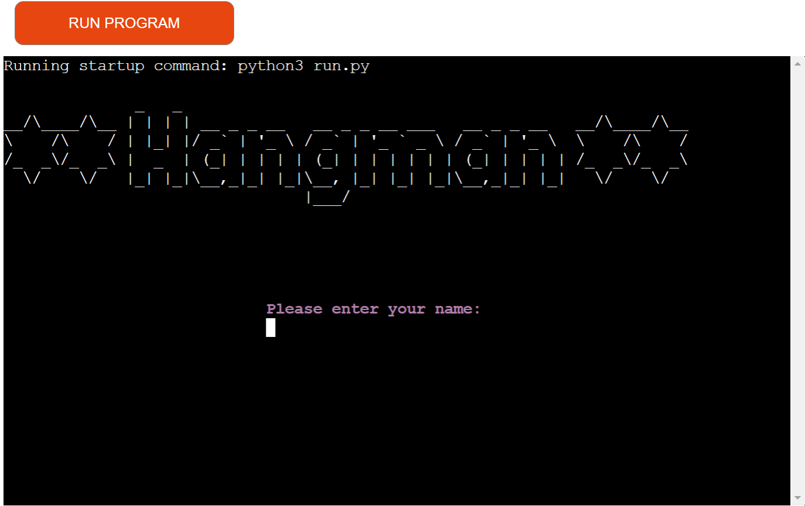

- Welcomes a user to the game with the name input field

### Second screen

Screenshots

- Welcome a user with their name and give a user option to either read the rules or continue to the next step

### Rules screen

Screenshots

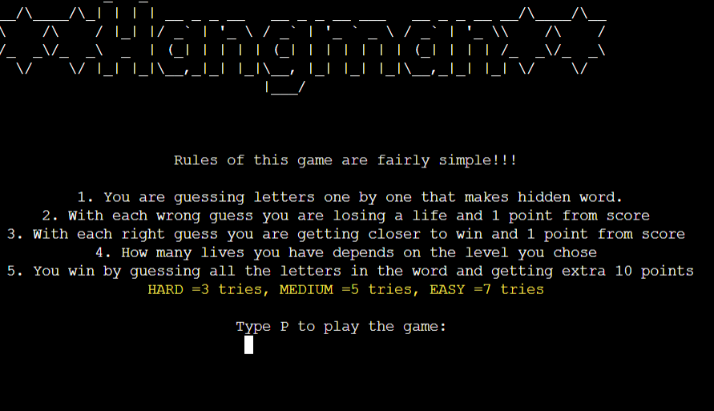

- Describes rules to the user and how to play the game

### Levels screen

Screenshots

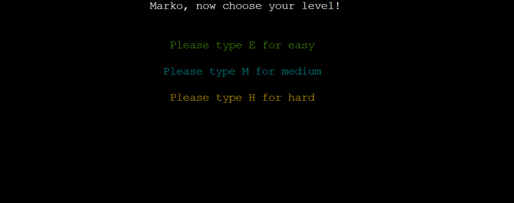

- Gives a user option to pick the difficulty level that will reflect on the tries he gets through the game

### Game screen

Screenshots

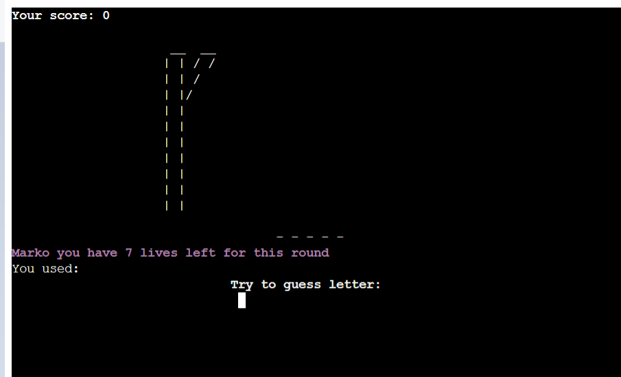

- This is also a play screen on which a user is guessing letters from the hidden word. A user is displayed with multiple sections: current score, already tried letters, hidden word, hangman art in different stages depends on a user progress and with remaining lives/tries that a user has for this game

### End game screen

Screenshots

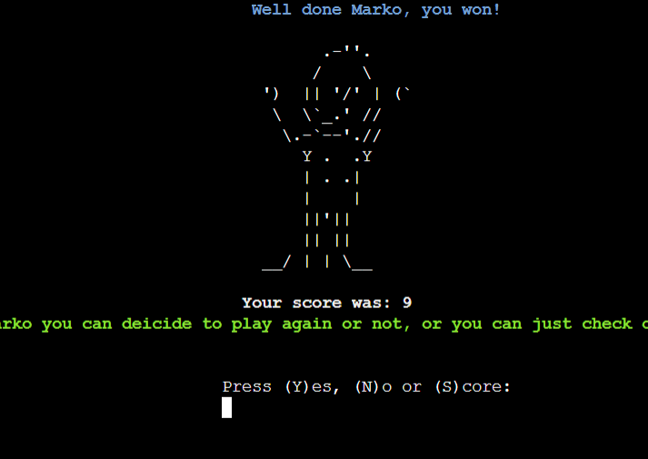

Screenshots

- A user is displayed with the completed hangman art(win or lose), his overall score and the option to play the game again, check scores, or exit the game

### Score screen

Screenshots

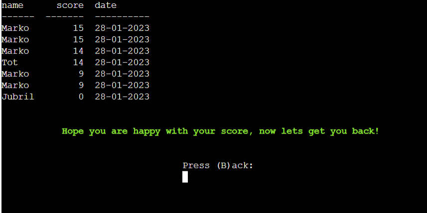

- A user is presented with a table that has 3 columns with name, score and current date that the game has been played, and scores are presented from best to worst

### Thank you screen

Screenshots

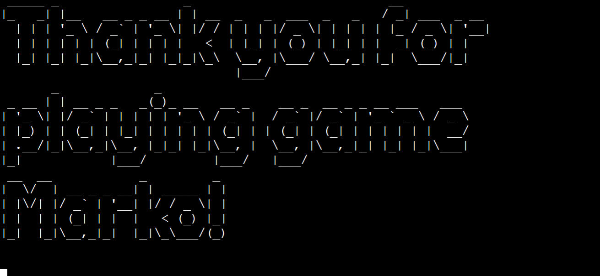

- A user is presented with ascci art thank you message

## Testing

### Testing User Stories

 - As a player, I want to be able to create a username for the game

| **Feature**  | **Action**                  | **Expected Result**                                          | **Actual Result** |
| ------------ | --------------------------- | ------------------------------------------------------------ | ----------------- |
| Welcome screen | There is a user name input field below the "Hangman" title | Type your username and press enter, your name will appear in later stages of the game | It works as expected |

Screenshots

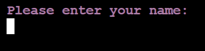

-  As a player, I want to be able to know the rules of the game

| **Feature** | **Action**                           | **Expected Result**                                           | **Actual Result** |
| ----------- | ------------------------------------ | ------------------------------------------------------------- | ----------------- |
| Hangman rules screen | On the second screen type "R" and press "Enter" that will lead you to a separate screen which will display the rules of the game | Game rules are shown on the separate clear screen | It works as expected |

Screenshots

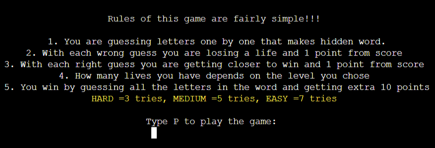

 - As a player, I want the be able to pick the level of difficulty for the game

| **Feature** | **Action**                                         | **Expected Result**                            | **Actual Result** |
| ----------- | -------------------------------------------------- | ---------------------------------------------- | ----------------- |
| Choose level screen | After reading the rules or just skipping them, you come to a screen with 3 difficulty options (E, M, H) | By using the keyboard, the difficulty level will be set for the game | It works as expected |

Screenshots

-  As a player, I want the game to show my progress in the game either by winning or loosing.

| **Feature** | **Action**                                 | **Expected Result**                                                                     | **Actual Result** |
| ----------- | ------------------------------------------ | --------------------------------------------------------------------------------------- | ----------------- |
| Game screen  | Start guessing random letters by inputting on the keyboard and pressing enter | Hangman art is displayed depending on the progress and levels, a message with remaining lives is shown as a secret word with right-guessed letters shown | It works as expected |

Screenshots

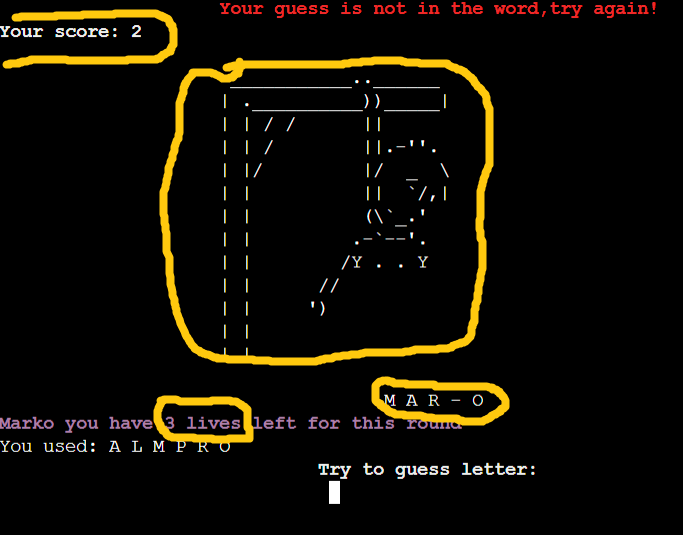

-  As a player, I want a warning message to appear on the screen if I accidentally enter an invalid character, number or just repeat the letter I used already

| **Feature** | **Action**                                     | **Expected Result**                                                                | **Actual Result** |
| ----------- | ---------------------------------------------- | ---------------------------------------------------------------------------------- | ----------------- |
| Game screen | Type either a special character, number or repeat letter you already guessed | Message to apear on top of the screen, to warn user about invalid input and not to count as try in the game | It works as expected |

Screenshots

-  As a player, I want to get some message if I win, and if I lose, I want to know what was the secret word

| **Feature** | **Action**                                     | **Expected Result**                                                                | **Actual Result** |
| ----------- | ---------------------------------------------- | ---------------------------------------------------------------------------------- | ----------------- |
| Game screen  | By either winning or losing the game new screen will display | Message on the top of the screen that will tell me If I won the game and a message with the completed art of hangman with a secret word will appear on the screen | It works as expected |

Screenshots

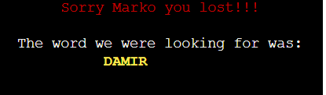

-  As a player, after every game I want to be able to have option to play again or not

| **Feature** | **Action**                                     | **Expected Result**                                                                | **Actual Result** |
| ----------- | ---------------------------------------------- | ---------------------------------------------------------------------------------- | ----------------- |
| End game screen  | After finishing the game message with options for the user will appear on the screen | By pressing "Y" to be directed to choose the level for another game | It works as expected |

Screenshots

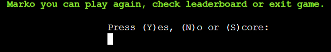

-  As a player, I want to be able to see my score/progress through the game and to have option to check other people scores

| **Feature** | **Action**                | **Expected Result**                                                  | **Actual Result** |
| ----------- | ------------------------- | -------------------------------------------------------------------- | ----------------- |
| Game page & Score page  | Play the game | User score is displayed on top of the screen, and once user finish his game he can simply check leaderboard | It work as expected  |

Screenshots

Screenshots

 ### Validation Testing
- Used PEP8 Python Validator to validate my code

Validated code

 ### Bugs
| **Bug**                                                                                                         | **Fix**                                                                                                                                                       |
| --------------------------------------------------------------------------------------------------------------- | ------------------------------------------------------------------------------------------------------------------------------------------------------------- |
| Couldn't connect function levels() to the game() function to upload difficulty level across game| Redo whole function levels() with changed while loop|
| The user name wasn't appearing across the game     | Created a global variable called name                                                                                             |
| After reading the rules for the game and playing the game user was only able to play the game twice before the error message appeared, basically, the user was stuck in  levels() function                                                  | Created a new function to ask the user if he wishes to read the rules or not, and separated rules() function from levels() function          |
| Poor visual presentation of the game   | Introduced colorama and add spacing to the print statements across the game       |
| In the levels() function user had to confirm his choice twice before he was able to continue with the game                  | Created global variable 'lives', which were later on called for the user tries instead levels() function                                                                                                   |
| After finishing thegame once user was only able to choose a difficulty level before the terminal was cut out                            | called game() function bellow levels() function in end_game() function                                                                                                    |
| Print statements from different screens were pilling up on top of each other, with user inputs and progress of the game                          | Imported os and created function which was used across the game to clear the terminal screen                                 |
| Too long lines during code                   | Run and formatted code through black.vercel.app                              |
| Game worked locally but not on Heroku app                   |  Created new excell sheet with new credentials and repeated process of connecting APIs, googleshet, heroku                           |
                                                                                                         
 ### Manual Testing
  #### Welcome screen

Screenshots

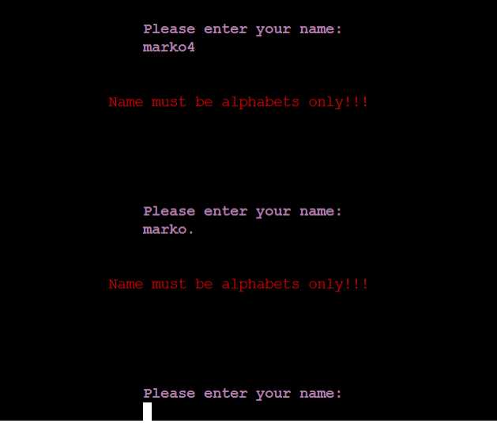

  - I've tested that the input field for name takes only alphabet letters and nothing else and that error message is displayed to the user that warns the user of his input

 #### Decide to check the rules screen 

Screenshots

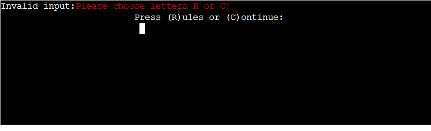

   - I've tested that the user is allowed to enter only letters that are displayed on the screen and that the error message is shown to the user and that those options lead the user to the screen that he chose to go to

 #### Rules screen

Screenshots

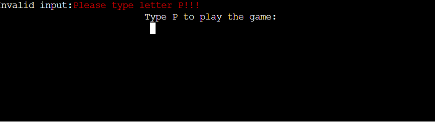

  - I've tested that user can only input the letter "P" which will take a user to the next screen, the wrong input is displayed to the user

 #### Level difficulty screen

Screenshots

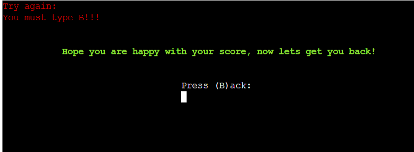

   - I've tested that the user can only input 3 letters/ options that are provided to him and if he inputs the wrong letter that error message is displayed to the user

 #### Game screen

Screenshots

Screenshots

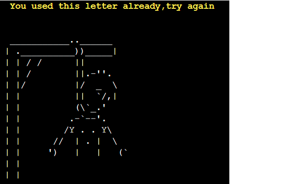

Screenshots

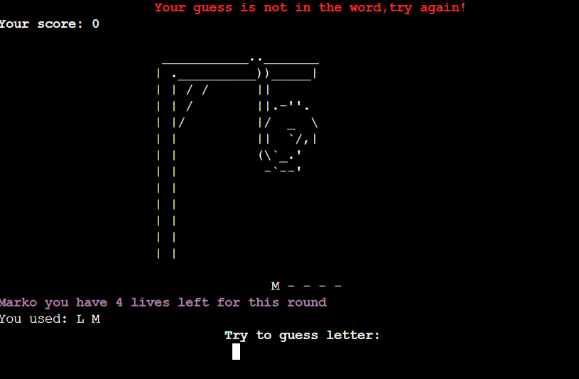

  - I've tested multiple inputs on this screen
  - If a user repeats the letter that he already guessed error message will be displayed to the user
  - If a user inputs the number or any other special character error message will be displayed to the user
  - If a user inputs is wrong error message will notify the user 

#### End game screen

Screenshots

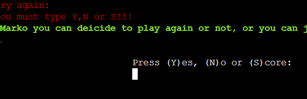

  - I've tested that the user is only allowed to input letters that are instructed on the screen and that with wrong input error message displays to user 

 #### Score screen

Screenshots

   - I've tested that user is only allowed to press letter "B" to go back to previous screen and that error message is displayed to the user if he puts wrong input

 #### Hangman game

  - I've tested that all instructions are displayed to the user and that all inputs that the user has to type will bring user to desired and expected outcome like it's displayed on the screens across the game
   - I've tested that score on the game page is with the rules of the game and that the overall score is uploaded to the google sheet and that data is printed out on the final screen if a user wishes to check the leaderboard
  - Also tested that data is presented to the user from top (best score) to the bottom

## Future Features
   - Features that I would like to add to the game would be, different categories that users can pick to guess the secret word
   - Use API services to randomly get words rather than storing them in folders
   - The user to be able to use a hint if he gets stuck
  
## Deployment
### Gitpod and git
 -  I created a repository in Github, named it Portafolio-3, and used the template Code-Institute-org/python-essentials-template
 -  Once the repository is created, click the green button to the right (Gitpod) to open Gitpod
 -  In the terminal, I've used the python3 run.py file provided by the template
 - At regular appropriate intervals the latest version of the code was saved via the git add and git commit commands. Appropriate commit messages were added to control the revisions.
- The git push command was used to push all committed code and documentation to the repository for secure storage.
 

### Heroku
This project was deployed using Code Institutes mock terminal for Heroku.

-  Log in to Heroku and click "New" and "Create new app"
-  Name the new app and click "Create new app".
-  In "Settings" select "BuildPack" and select Python and Node.js. (Python must be at the top of the list).
-  While still in "Settings", click "Reveal Config Vars" and add the following; KEY: PORT, VALUE: 8000. and
content from creds.json file
-  Click on "Deploy" and select your deploy method and search for the repository name.
-  Click "Connect" on a selected repository.
-  Either choose "Enable Automatic Deploys" or "Deploy Branch" in the manual deploy section.
-  Heroku will now deploy the app.

## Credits
- Code & Content
  - I give credit to [Stack overflow](https://www.stackoverflow.com/), [MDN Web Docs](https://developer.mozilla.org/en-US/) & [W3 Schools](https://www.w3schools.com/) for helping me resolve issues with Python while coding through
  - Inspiration and guidance/problem solving through project came from [kite](https://www.youtube.com/@KiteHQ), [Sanjin Dedic](https://www.youtube.com/@SanjinDedic), [Tech with Tim](https://www.youtube.com/@TechWithTim) 
   youtube channels, and [Geeksforgeeks](https://www.geeksforgeeks.org/), [Codefather](https://codefather.tech/) websites
  - Credits for code os.system('cls' if os.name == 'nt' else 'clear') that clear screen was found on [stackoverflow](https://stackoverflow.com/questions/2084508/clear-terminal-in-python)
  - Credits for my hangman art go to  [Ascii](https://ascii.co.uk/art/hangman)
  - To create banner for my page with title name I used [Patorjk](https://patorjk.com/)
  - Giving credit to [Lucid chart](ttps://www.lucidchart.com/) for providing tools to easily create my flow chart
  - Credits for centering my content in the terminal with the code  os.get_terminal_size().columns goes to [Geeksforgeeks](https://www.geeksforgeeks.org/)

- Acknowledgment
  - Special thank you goes to mentor Jubril Akolade who helped me to finish my project
  - I would like to thank tutor support from Code Institue for their help, as well as the whole  Code Institue for giving me the opportunity to attend this course and to work on this project
  - I would also like to thank my colleagues for their support
  - Last but not least I would like to thank our coordinator Irene from Code Institute for giving guidance and schedules on daily basis in the classroom